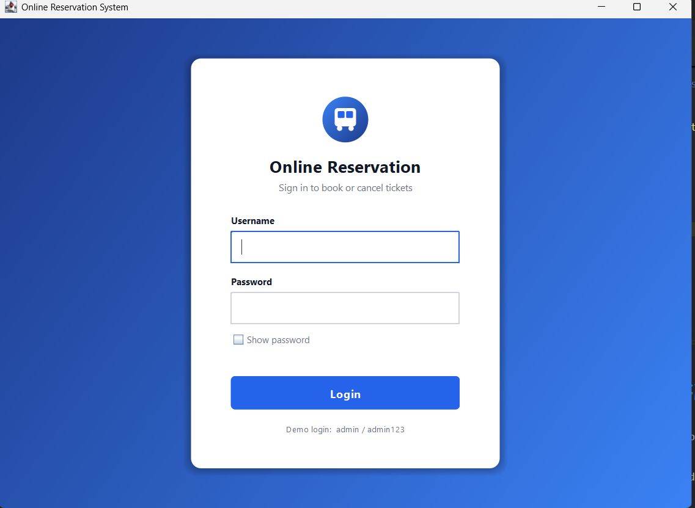
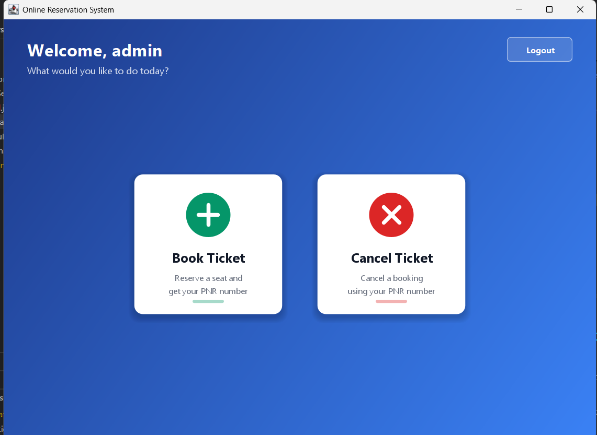
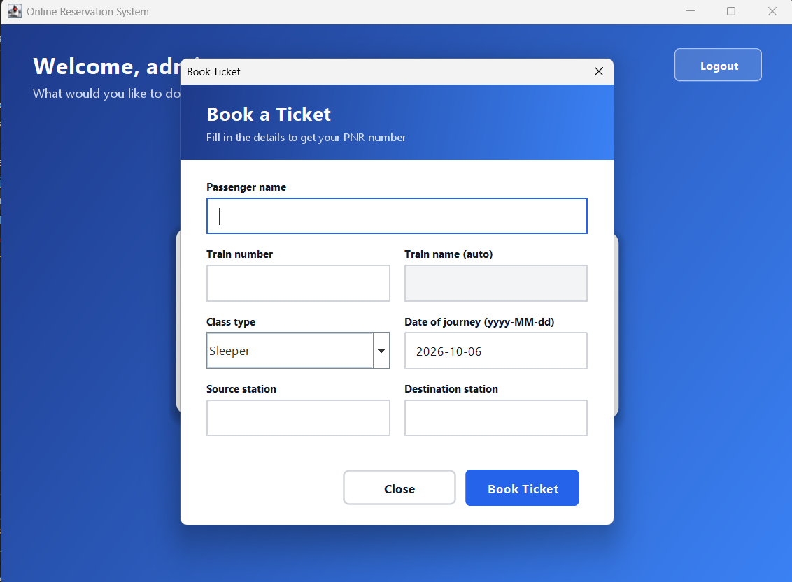
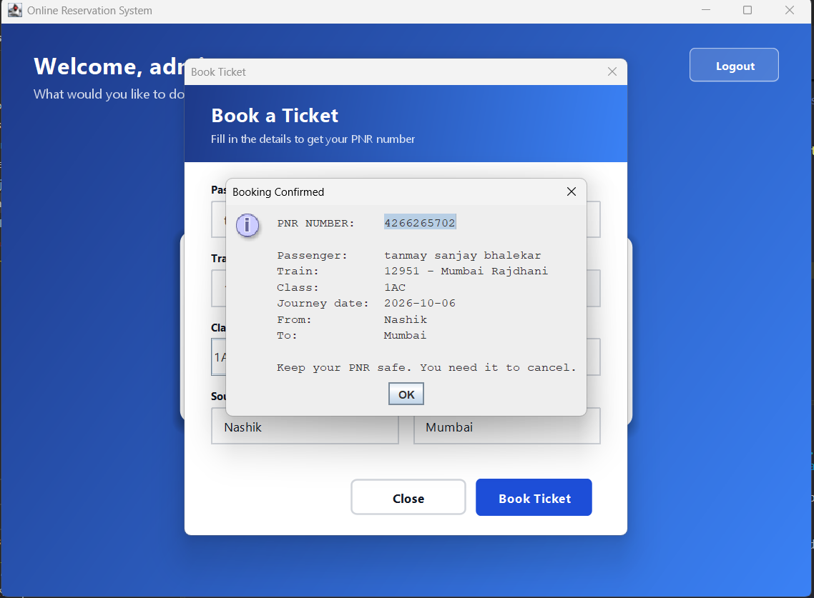
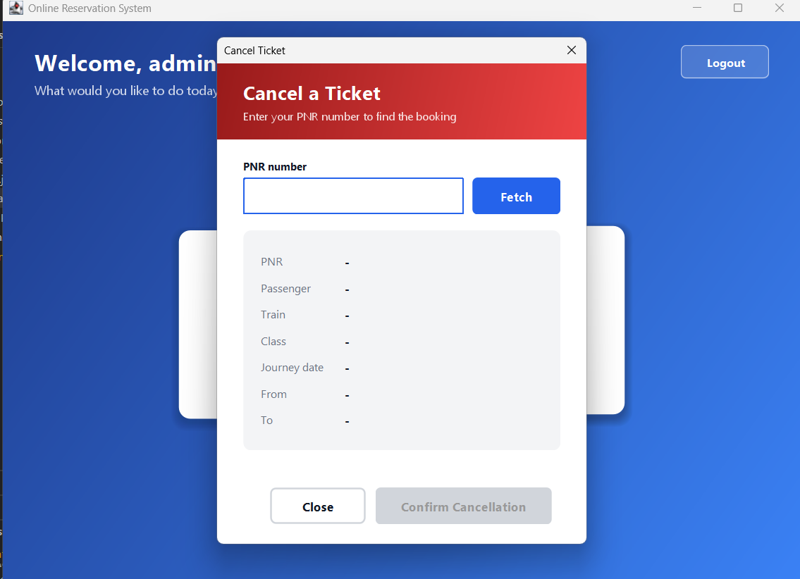

# Online Reservation System

A GUI-based train reservation system built with Java Swing, JDBC and SQLite. Users can log in, book tickets and cancel bookings using a PNR number.

## Features
- Login form with "Access Denied" for invalid credentials
- Reservation form: passenger name, train number, train name (auto-filled), class type, date of journey, source and destination
- Booking saved to the database with an auto-generated PNR
- Confirmation dialog showing the booking details
- Cancellation form: fetch a booking by PNR, then confirm with an "Are you sure?" dialog
- Input validation: no empty fields, valid date format, numeric train number
- Passwords stored as SHA-256 hashes
- PreparedStatement used to prevent SQL injection

## Tech Stack
Java, Swing, JDBC, SQLite

## How to Run
1. Install JDK 17 or newer.
2. Download the SQLite driver `sqlite-jdbc-3.36.0.3.jar` and add it to the project classpath.
3. Run `MainApp.java`. The database `reservation.db` is created automatically.
4. Login with: **admin / admin123**

## Sample Train Numbers
12951, 12301, 12627, 12009, 12723

## Screenshots

### Login

### Main Menu

### Booking

### Booking Confirmation

### Cancellation

### Cancel Confirmation

